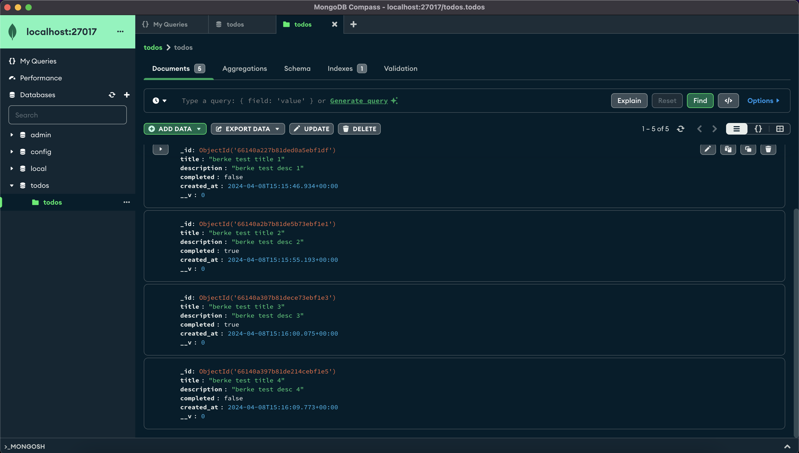

## Todo App With MongoDB and Node.js

This application shows the conteinarization of Todo App wtih docker compose. There are 2 services:

- todo-app: It is built from the Dockerfile for the application.
- mongodb: It is taken from `mongo` image.

The provided Dockerfile sets up a containerized environment for Todo App.

#### Dockerfile For Todo App

```dockerfile
FROM node:21-slim
WORKDIR /opt/node-todo-app
COPY package.json .
RUN npm install
COPY src/ .
CMD ["node", "server.js"]
```

This compose configuration will build the Dockerfile and create the image using `build` key. docker-compose.yml and Dockerfile are at the same directory and `.` defines it.

#### Compose File

```yml
version: "3.4"
services:
  todo-app:
    container_name: compose-todo-app
    build: .
    ports:
      - 3000:3000
  mongodb:
    container_name: mongo-db
    image: mongo
    ports:
      - 27017:27017
    volumes:
      - todo-app-data:/data/db
volumes:
  todo-app-data:
```

- `todo-app` is built and used for the application itself.
- `mongodb` is taken from `mongo` image.

#### Build Image

```bash
docker-compose build
```

#### Check Images

```bash
docker images
```

```bash
REPOSITORY                      TAG           IMAGE ID       CREATED         SIZE
10compose-todo-app-todo-app     latest        3440449b6b8b   4 seconds ago   269MB
```

`10compose-todo-app` is for the folder name containing this `docker-compose.yml`. And `todo-app` is the definition for `service` at compose configuration file.

#### Run Container

```bash
docker-compose up
```

- 2 containers, `todo-app` and `mongo-db`, will be up and running.

#### Check Containers

```bash
docker ps
docker container ls
```

```bash
CONTAINER ID   IMAGE                         COMMAND                  CREATED          STATUS         PORTS                      NAMES
0f5b9af1970f   mongo                         "docker-entrypoint.s…"   9 seconds ago    Up 9 seconds   0.0.0.0:27017->27017/tcp   mongo-db
f8e4db4e5925   10compose-todo-app-todo-app   "docker-entrypoint.s…"   50 seconds ago   Up 9 seconds   0.0.0.0:3000->3000/tcp     compose-todo-app
```

#### Use Postman While Containers Are Running

```sh
POST http://localhost:3000/todo

# request body
{
  "title": "Title 1",
  "description": "Description 1",
  "completed": false
}
```

Send another `POST` request.

`POST http://localhost:3000/todo`

- request body

```sh
{
  "title": "Title Test 1",
  "description": "Description test 1",
  "completed": false
}
```

Use `GET` request to get the data.
`GET http://localhost:3000`

```json
[
  {
    "_id": "66042fc60aee726d1d7e3860",
    "title": "Title Test 1",
    "description": "Description test 1",
    "completed": false,
    "created_at": "2024-03-27T14:40:06.554Z",
    "__v": 0
  },
  {
    "_id": "660430020aee72256d7e3862",
    "title": "Title Test 2",
    "description": "Description test 2",
    "completed": false,
    "created_at": "2024-03-27T14:41:06.441Z",
    "__v": 0
  }
]
```

- Port mapping is applied when running `mongo` container. So, `MongoDB` can be accessed at `mongodb://localhost:27017` connection.


