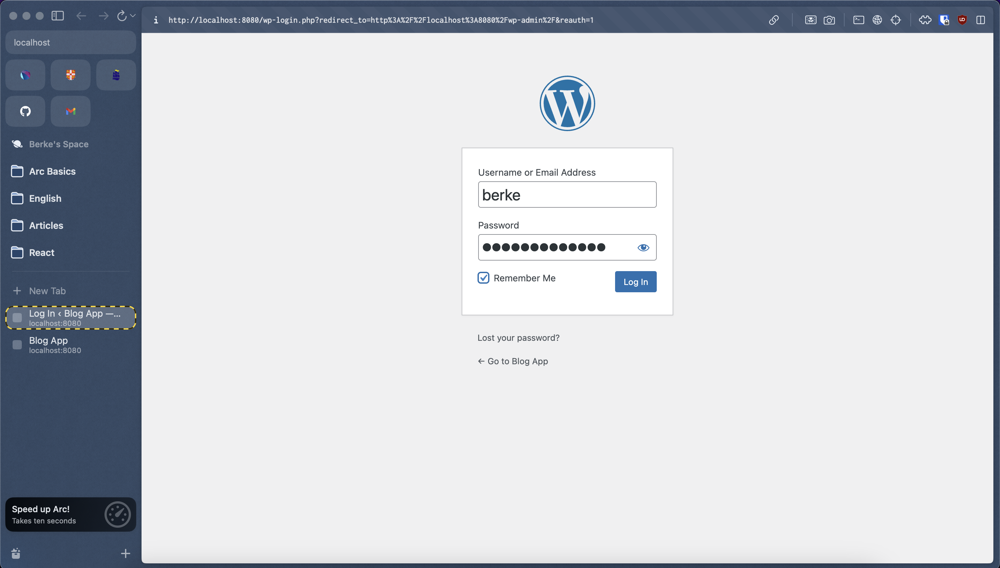
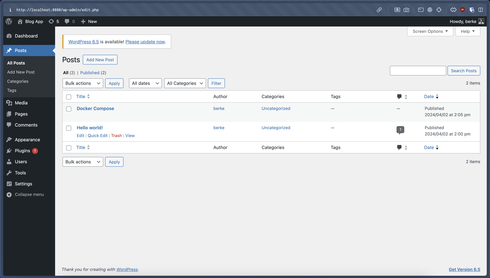
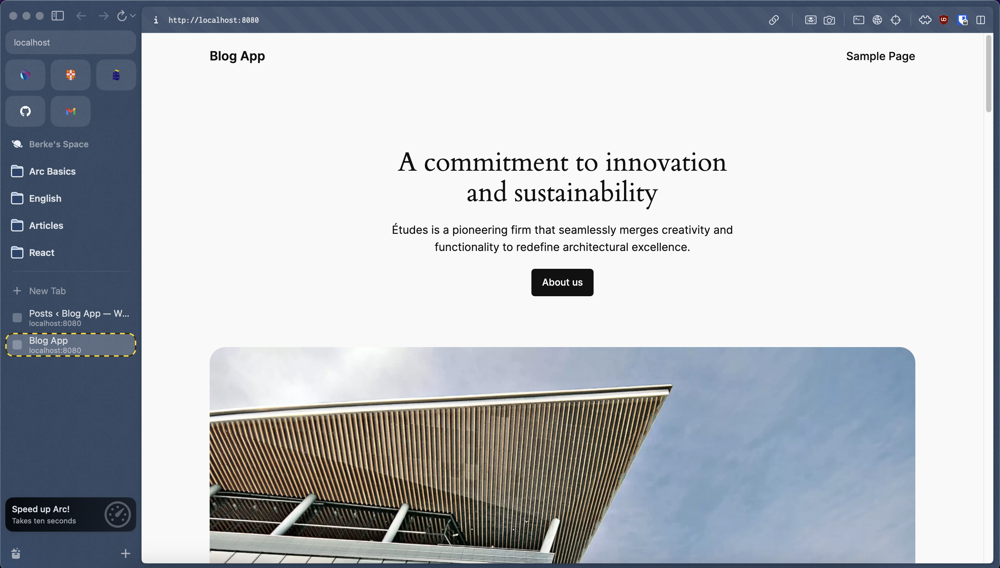

## WordPress Server With Docker Compose

The `docker-compose.yml` file defines a Docker Compose setup for running `WordPress` along with a `MySQL` database. It orchestrates two services: `wordpress` and `db` (which is the `MySQL` database).

#### Compose File

```yml
version: "3.4"
services:
  wordpress:
    image: wordpress
    container_name: my-wordpress
    ports:
      - 8080:80
    environment:
      - WORDPRESS_DB_HOST=db
      - WORDPRESS_DB_USER=bloguser
      - WORDPRESS_DB_PASSWORD=test123
      - WORDPRESS_DB_NAME=blogdb
    volumes:
      - wordpress:/var/www/html
  db:
    image: mysql:8.0
    container_name: my-mysql
    restart: always
    environment:
      - MYSQL_DATABASE=blogdb
      - MYSQL_USER=bloguser
      - MYSQL_PASSWORD=test123
      - MYSQL_RANDOM_ROOT_PASSWORD="1"
    volumes:
      - db:/var/lib/mysql
volumes:
  wordpress:
  db:
```

#### Services

In the `wordpress` service:

- It pulls the official WordPress image from DockerHub.
- Sets a custom container name `my-wordpress`.
- Maps port 8080 of the host to port 80 of the container, allowing access to `WordPress` from the host machine.
- Specifies environment variables required by WordPress to connect to the `MySQL` database (`WORDPRESS_DB_HOST`, `WORDPRESS_DB_USER`, `WORDPRESS_DB_PASSWORD`, `WORDPRESS_DB_NAME`).
- Applies volume mapping named `wordpress` to the container's `/var/www/html` directory, which allows persistent storage for `WordPress` files.

In the `db` service:

- It pulls the official `MySQL` image from DockerHub.
- Sets a custom container name `my-mysql`.
- Specifies restart: always to ensure the container restarts automatically if it crashes or is stopped.
- Defines environment variables required to configure the MySQL database (`MYSQL_DATABASE`, `MYSQL_USER`, `MYSQL_PASSWORD`, `MYSQL_RANDOM_ROOT_PASSWORD`).
- Applies volume mapping named `db` to the container's `/var/lib/mysql` directory, which allows persistent storage for `MySQL` data.

#### Run Container

```bash
docker-compose up
```

- 2 containers, `my-wordpress` and `my-mysql`, will be up and running.

#### Check Containers

```bash
docker ps
docker container ls
```

```bash
CONTAINER ID   IMAGE       COMMAND                  CREATED          STATUS         PORTS                  NAMES
dc8724460d53   wordpress   "docker-entrypoint.s…"   10 seconds ago   Up 9 seconds   0.0.0.0:8080->80/tcp   my-wordpress
67c90ce2ebce   mysql:8.0   "docker-entrypoint.s…"   6 days ago       Up 9 seconds   3306/tcp, 33060/tcp    my-mysql
```

Go to `http://localhost:8080/wp-admin/` for wordpress admin panel and login.



Admin panel.



Go to `http://localhost:8080/` to see blog post.


