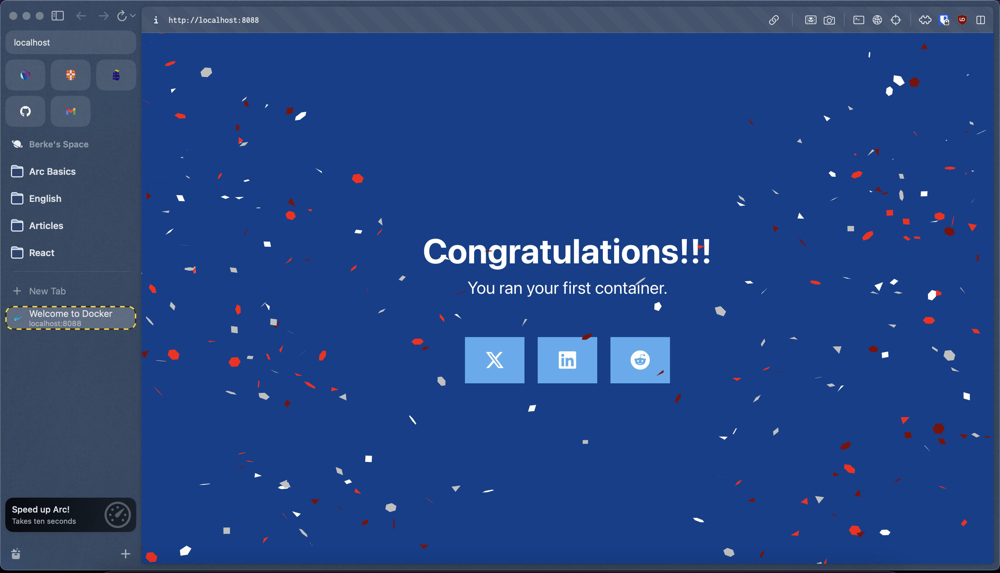

## Welcome to Docker

Dockerizing application.

#### Dockerfile

```dockerfile
# Start your image with a node base image
FROM node:18-alpine

# The /app directory should act as the main application directory
WORKDIR /app

# Copy the app package and package-lock.json file
COPY package*.json ./

# Copy local directories to the current local directory of our docker image (/app)
COPY ./src ./src
COPY ./public ./public

# Install node packages, install serve, build the app, and remove dependencies at the end
RUN npm install \
    && npm install -g serve \
    && npm run build \
    && rm -fr node_modules

EXPOSE 3000

# Start the app using serve command
CMD [ "serve", "-s", "build" ]
```

#### Building

Maintainers should see [MAINTAINERS.md](MAINTAINERS.md).

##### Build and run:

```sh
docker build -t welcome-to-docker .
```

##### Check Images

```sh
docker images
```

```
REPOSITORY            TAG        IMAGE ID       CREATED          SIZE
welcome-to-docker     latest     06ccb647aff1   12 seconds ago   225MB
```

##### Run

```
docker run -d -p 8088:3000 --name welcome-to-docker welcome-to-docker
```

##### Check Running Containers

```
docker ps
```

```
CONTAINER ID   IMAGE               COMMAND                  CREATED         STATUS         PORTS                    NAMES
fa718ef5d505   welcome-to-docker   "docker-entrypoint.s…"   5 seconds ago   Up 4 seconds   0.0.0.0:8088->3000/tcp   welcome-to-docker
```

##### Access App In The Browser

Open `http://localhost:8088` in your browser.



Reference: https://docs.docker.com/guides/walkthroughs/run-a-container/
