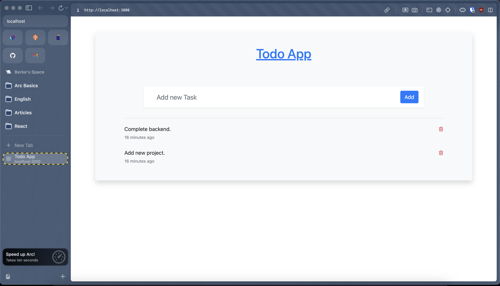

## Todo App With Compose

This application shows the conteinarization of Todo App wtih `docker compose`.

The provided Dockerfile sets up a containerized environment for Todo App.

#### Dockerfile For Todo App

```dockerfile
ARG NODE_VERSION=19.5.0

FROM node:${NODE_VERSION}-alpine

# Use production node environment by default.
ENV NODE_ENV production

WORKDIR /usr/src/app

# Download dependencies as a separate step to take advantage of Docker's caching.
# Leverage a cache mount to /root/.npm to speed up subsequent builds.
# Leverage a bind mounts to package.json and package-lock.json to avoid having to copy them into
# into this layer.
RUN --mount=type=bind,source=package.json,target=package.json \
    --mount=type=bind,source=package-lock.json,target=package-lock.json \
    --mount=type=cache,target=/root/.npm \
    npm ci --include=dev

# install nodemon for hot-reloading
RUN npm install -g nodemon

# Copy the rest of the source files into the image.
COPY . .

# Run the application as a non-root user.
RUN  chown -R node /usr/src/app
USER node

# Expose the port that the application listens on.
EXPOSE 3000

# Run the application in dev mode to use with Compose watch feature
CMD npm run dev
```

This compose configuration will build the Dockerfile and create the image using `build` key. docker-compose.yml and Dockerfile are at the same directory and `.` defines it.

#### Compose File

```yml
services:
  todo-app:
    build:
      context: ./app
    depends_on:
      - todo-database
    environment:
      NODE_ENV: production
    ports:
      - 3000:3000
      - 35729:35729
    develop:
      watch:
        - path: ./app/package.json
          action: rebuild
        - path: ./app
          target: /usr/src/app
          action: sync

  todo-database:
    image: mongo:6
    volumes:
      - database:/data/db
    ports:
      - 27017:27017

volumes:
  database:
```

- `todo-app` is built and used for the application itself.
- `todo-database (mongodb)` is pulled from `mongo` image.

#### Build Image

```bash
docker-compose build
```

#### Check Images

```bash
docker images
```

```bash
REPOSITORY                        TAG          IMAGE ID       CREATED          SIZE
14compose-todo-app-2-todo-app     latest       a53b05472fab   12 minutes ago   224MB
mongo                             6            462e60a3a0cd   3 days ago       660MB
```

`14compose-todo-app-2` is for the folder name containing this `compose.yml`. And `todo-app` is the definition for `service` at compose configuration file.

#### Run Container

```bash
docker compose up -d
```

- 2 containers will be up and running.

#### Check Containers

```bash
docker ps
docker container ls
```

```bash
CONTAINER ID   IMAGE                           COMMAND                  CREATED          STATUS          PORTS                                              NAMES
da291d1a138b   14compose-todo-app-2-todo-app   "docker-entrypoint.s…"   14 minutes ago   Up 14 minutes   0.0.0.0:3000->3000/tcp, 0.0.0.0:35729->35729/tcp   14compose-todo-app-2-todo-app-1
8e14ea4e19ec   mongo:6                         "docker-entrypoint.s…"   14 minutes ago   Up 14 minutes   0.0.0.0:27017->27017/tcp                           14compose-todo-app-2-todo-database-1
```

#### Access App In The Browser

Go to http://localhost:3000/ add add new todo items.


