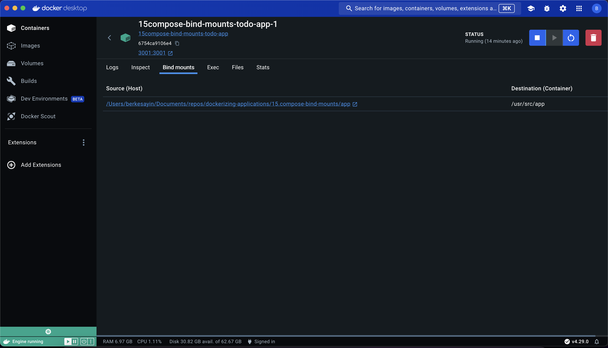

## Bind Mount Example With Compose

`Docker` isolates all content, code, and data in a container from your local filesystem. By default, containers can't access directories in your local filesystem.

Sometimes, you may want to access a directory from your local filesystem. To do this, you can use `bind mounts`.

Add a `bind mount` to access data on your system from a container. A `bind mount` lets you share a directory from your host's filesystem into the container.

#### Compose File

```yaml
services:
  todo-app:
    build:
      context: ./app
    links:
      - todo-database
    volumes:
      - ./app:/usr/src/app
      - /usr/src/app/node_modules
    ports:
      - 3001:3001

  todo-database:
    image: mongo:6
    command: mongod --port 27018
    ports:
      - 27018:27018
```

Here we add a `bind mount` to access a local folder from a container. You can use this to develop faster without having to rebuild your container when updating your code.

You can try it out using the following command.

```sh
docker compose up -d
```

```sh
docker ps
```

```sh
CONTAINER ID   IMAGE                            COMMAND                  CREATED          STATUS          PORTS                                 NAMES
6754ca9106e4   15compose-bind-mounts-todo-app   "docker-entrypoint.s…"   15 minutes ago   Up 15 minutes   0.0.0.0:3001->3001/tcp                15compose-bind-mounts-todo-app-1
bbbd6e966991   mongo:6                          "docker-entrypoint.s…"   15 minutes ago   Up 15 minutes   27017/tcp, 0.0.0.0:27018->27018/tcp   15compose-bind-mounts-todo-database-1
```

And open http://localhost:3001 in your browser.


Container Details at `Docker Desktop`


