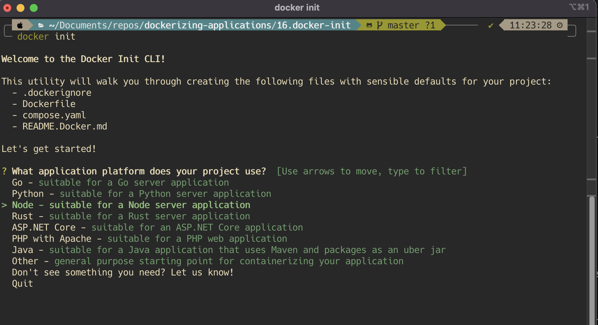
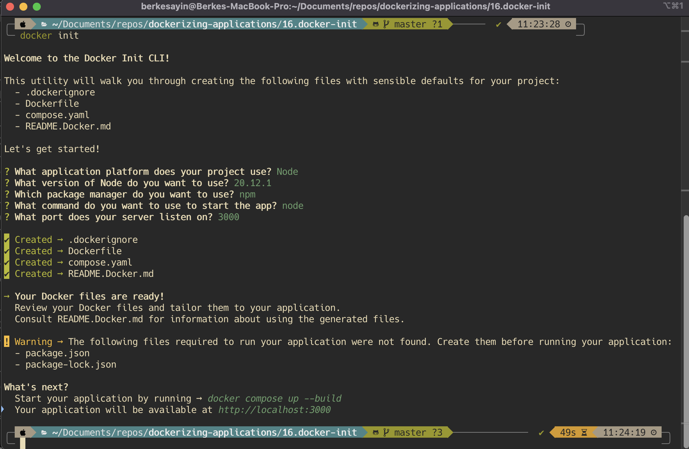

## docker init Example (Node Server App)

`docker init` walks you through a few questions to configure your project with sensible defaults. Specify your answers and press Enter.




These files is created:

- .dockerignore
- Dockerfile
- compose.yaml
- README.Docker.md

Your Docker files are ready. The `docker init` command tries its best to do the heavy lifting for you, but sometimes there's some assembly required. In this case, you can refer to the `Dockerfile` reference⁠ and `Compose file` reference⁠ to learn how to update the files created by `docker init`.

#### .dockerignore

```.dockerignore
# Include any files or directories that you don't want to be copied to your
# container here (e.g., local build artifacts, temporary files, etc.).
#
# For more help, visit the .dockerignore file reference guide at
# https://docs.docker.com/go/build-context-dockerignore/

**/.classpath
**/.dockerignore
**/.env
**/.git
**/.gitignore
**/.project
**/.settings
**/.toolstarget
**/.vs
**/.vscode
**/.next
**/.cache
**/*.*proj.user
**/*.dbmdl
**/*.jfm
**/charts
**/docker-compose*
**/compose.y*ml
**/Dockerfile*
**/node_modules
**/npm-debug.log
**/obj
**/secrets.dev.yaml
**/values.dev.yaml
**/build
**/dist
LICENSE
README.md
```

#### compose.yaml

```yaml
# Comments are provided throughout this file to help you get started.
# If you need more help, visit the Docker Compose reference guide at
# https://docs.docker.com/go/compose-spec-reference/

# Here the instructions define your application as a service called "server".
# This service is built from the Dockerfile in the current directory.
# You can add other services your application may depend on here, such as a
# database or a cache. For examples, see the Awesome Compose repository:
# https://github.com/docker/awesome-compose
services:
  server:
    build:
      context: .
    environment:
      NODE_ENV: production
    ports:
      - 3000:3000
# The commented out section below is an example of how to define a PostgreSQL
# database that your application can use. `depends_on` tells Docker Compose to
# start the database before your application. The `db-data` volume persists the
# database data between container restarts. The `db-password` secret is used
# to set the database password. You must create `db/password.txt` and add
# a password of your choosing to it before running `docker-compose up`.
#     depends_on:
#       db:
#         condition: service_healthy
#   db:
#     image: postgres
#     restart: always
#     user: postgres
#     secrets:
#       - db-password
#     volumes:
#       - db-data:/var/lib/postgresql/data
#     environment:
#       - POSTGRES_DB=example
#       - POSTGRES_PASSWORD_FILE=/run/secrets/db-password
#     expose:
#       - 5432
#     healthcheck:
#       test: [ "CMD", "pg_isready" ]
#       interval: 10s
#       timeout: 5s
#       retries: 5
# volumes:
#   db-data:
# secrets:
#   db-password:
#     file: db/password.txt
```

#### Dockerfile

```dockerfile
# syntax=docker/dockerfile:1

# Comments are provided throughout this file to help you get started.
# If you need more help, visit the Dockerfile reference guide at
# https://docs.docker.com/go/dockerfile-reference/

# Want to help us make this template better? Share your feedback here: https://forms.gle/ybq9Krt8jtBL3iCk7

ARG NODE_VERSION=20.12.1

FROM node:${NODE_VERSION}-alpine

# Use production node environment by default.
ENV NODE_ENV production


WORKDIR /usr/src/app

# Download dependencies as a separate step to take advantage of Docker's caching.
# Leverage a cache mount to /root/.npm to speed up subsequent builds.
# Leverage a bind mounts to package.json and package-lock.json to avoid having to copy them into
# into this layer.
RUN --mount=type=bind,source=package.json,target=package.json \
    --mount=type=bind,source=package-lock.json,target=package-lock.json \
    --mount=type=cache,target=/root/.npm \
    npm ci --omit=dev

# Run the application as a non-root user.
USER node

# Copy the rest of the source files into the image.
COPY . .

# Expose the port that the application listens on.
EXPOSE 3000

# Run the application.
CMD node
```

#### Building and running your application

When you're ready, start your application by running:
`docker compose up --build`.

Your application will be available at http://localhost:3000.

### Deploying your application to the cloud

First, build your image, e.g.: `docker build -t myapp .`.

If your cloud uses a different CPU architecture than your development machine (e.g., you are on a Mac M1 and your cloud provider is amd64), you'll want to build the image for that platform, e.g.:
`docker build --platform=linux/amd64 -t myapp .`.

Then, push it to your registry, e.g. `docker push myregistry.com/myapp`.

Consult Docker's [getting started](https://docs.docker.com/go/get-started-sharing/) docs for more detail on building and pushing.

### References

- [Docker's Node.js guide](https://docs.docker.com/language/nodejs/)
