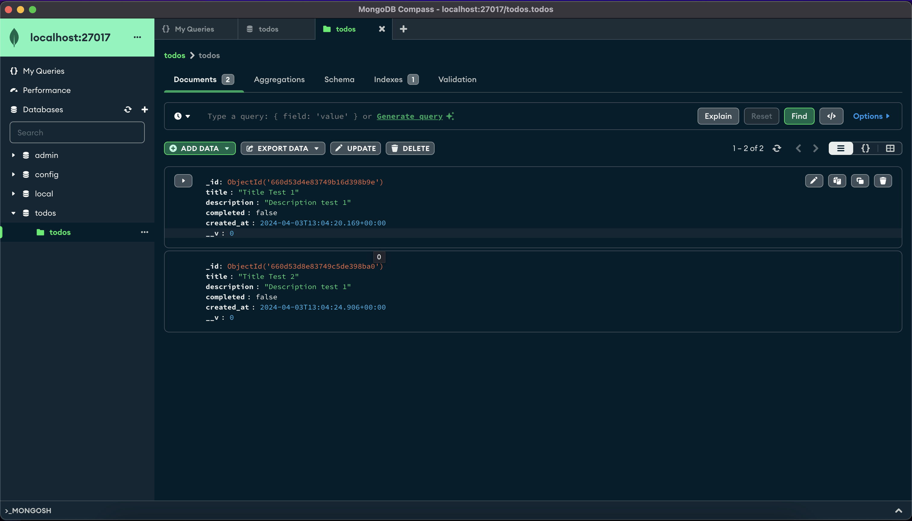

## Todo App With Node.js And MongoDB

#### Dockerfile

```dockerfile
FROM node:21-slim
WORKDIR /opt/todo-app
COPY package.json .
COPY src/ .
ENV PORT=4000
EXPOSE 4000
RUN npm install
CMD ["node", "server.js"]
```

#### Build Image

```bash
docker build . -t todo-app
```

#### Check Images

```bash
docker images
```

```bash
REPOSITORY      TAG           IMAGE ID       CREATED             SIZE
todo-app        latest        3717bcce4397   7 seconds ago       268MB
```

#### Run Container

This application uses `MongoDB`. 2 containers needed up and running to run the application.

1. MongoDB container from `mongo` image.
2. Application container from `todo-app` image.

Mongo Container

```bash
# mongo container
docker run --name mongo-server -p 27017:27017 mongo
```

Todo App Container (Used with --link)

```bash
# todo-app-container
docker run --link mongo-server:mongo-alias --name todo-app-c -p 4000:4000 todo-app
```

Connection at server.js

```js
await Mongoose.connect("mongodb://mongo-alias:27017/todos", {
  useNewUrlParser: true,
  useUnifiedTopology: true,
});
```

#### Check Containers

```bash
docker ps
docker container ls
```

```bash
CONTAINER ID   IMAGE      COMMAND                  CREATED          STATUS          PORTS                      NAMES
34cfcd7e51e6   todo-app   "docker-entrypoint.s…"   9 seconds ago    Up 9 seconds    0.0.0.0:4000->4000/tcp     todo-app-c
c4c324aeb508   mongo      "docker-entrypoint.s…"   2 minutes ago    Up 2 minutes    0.0.0.0:27017->27017/tcp   mongo-server
```

#### Use Postman While Containers Are Running

```sh
POST http://localhost:4000/todo

# request body
{
  "title": "Title 1",
  "description": "Description 1",
  "completed": false
}
```

Send another `POST` request.

```sh
POST http://localhost:4000/todo

# request body
{
  "title": "Title 2",
  "description": "Description 2",
  "completed": false
}
```

Use `GET` request to get the data.

```json
[
  {
    "_id": "660d53d4e83749b16d398b9e",
    "title": "Title Test 1",
    "description": "Description test 1",
    "completed": false,
    "created_at": "2024-04-03T13:04:20.169Z",
    "__v": 0
  },
  {
    "_id": "660d53d8e83749c5de398ba0",
    "title": "Title Test 2",
    "description": "Description test 1",
    "completed": false,
    "created_at": "2024-04-03T13:04:24.906Z",
    "__v": 0
  }
]
```

- Port mapping is applied when running `mongo` container. So, `MongoDB` can be accessed at `mongodb://localhost:27017` connection.


