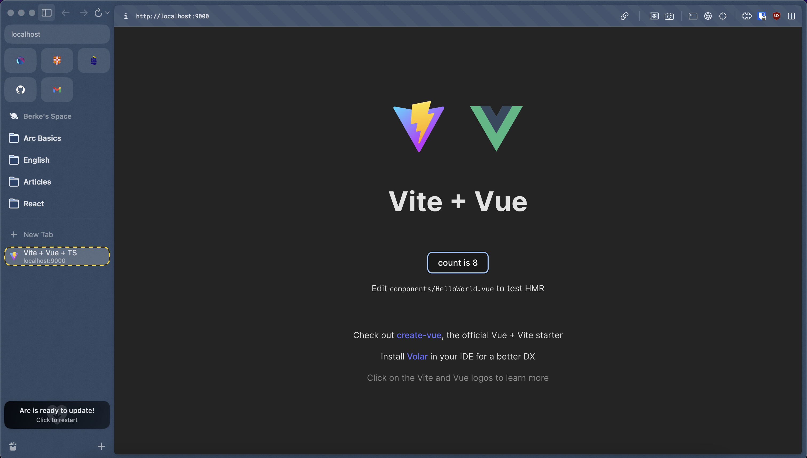

## Vue Application

The provided Dockerfile sets up a containerized environment for a Vue (SPA) application.

#### Dockerfile

```dockerfile
FROM node:21-slim
WORKDIR /vue-app
COPY package.json .
RUN npm install
COPY src/ .
COPY . .
RUN npm install -g live-server
RUN npm run build
EXPOSE 8080
CMD ["live-server", "dist"]
```

#### Build Image

```bash
docker build . -t vue-app
```

#### Check Images

```bash
docker images
```

```bash
REPOSITORY       TAG           IMAGE ID       CREATED          SIZE
vue-app          latest        dc1e7693809b   23 seconds ago   419MB
```

#### Run Container

```bash
docker run -p 9000:8080 vue-app
```

- Go to `localhost:9000`

#### Check Containers

```bash
docker ps
docker container ls
```

```bash
CONTAINER ID   IMAGE     COMMAND                  CREATED         STATUS         PORTS                    NAMES
4f3c95febe8a   vue-app   "docker-entrypoint.s…"   3 seconds ago   Up 3 seconds   0.0.0.0:9000->8080/tcp   vue-app-c
```


