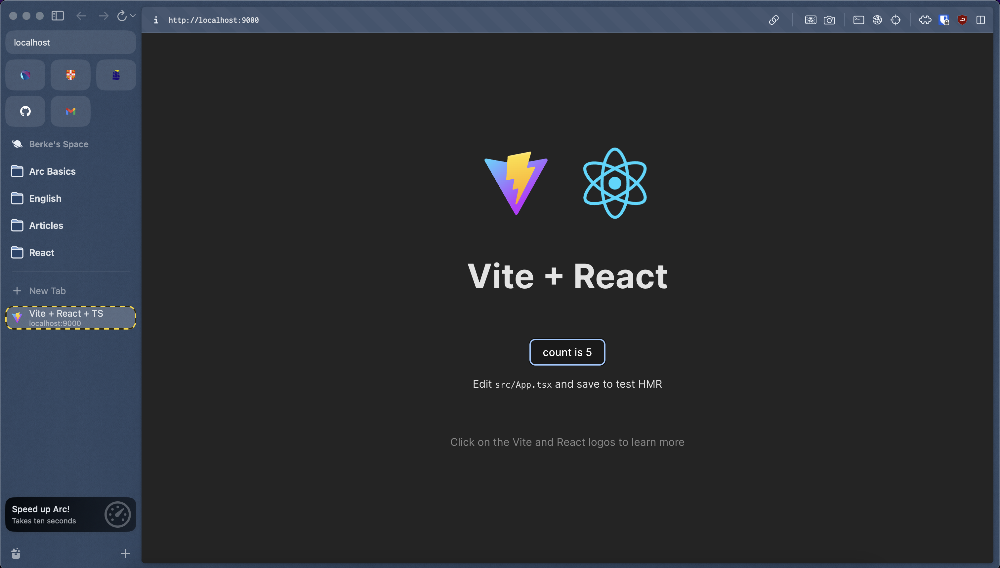

## React Application

The provided Dockerfile sets up a containerized environment for a React (SPA) application.

#### Dockerfile

```dockerfile
FROM node:21-slim
WORKDIR /react-app
COPY package.json .
RUN npm install
COPY src/ .
COPY . .
RUN npm install -g live-server
RUN npm run build
EXPOSE 8080
CMD ["live-server", "dist"]
```

#### Build Image

```bash
docker build . -t react-app
```

#### Check Images

```bash
docker images
```

```bash
REPOSITORY      TAG           IMAGE ID       CREATED         SIZE
react-app       latest        cbbd51044ddd   5 seconds ago   736MB
```

#### Run Container

```bash
docker run --name react-app-c -p 9000:8080 react-app
```

- Go to `localhost:9000`

#### Check Containers

```bash
docker ps
docker container ls
```

```bash
CONTAINER ID   IMAGE       COMMAND                  CREATED         STATUS         PORTS                    NAMES
ebc31ced6d5a   react-app   "docker-entrypoint.s…"   2 minutes ago   Up 2 minutes   0.0.0.0:9000->8080/tcp   react-app-c

```


