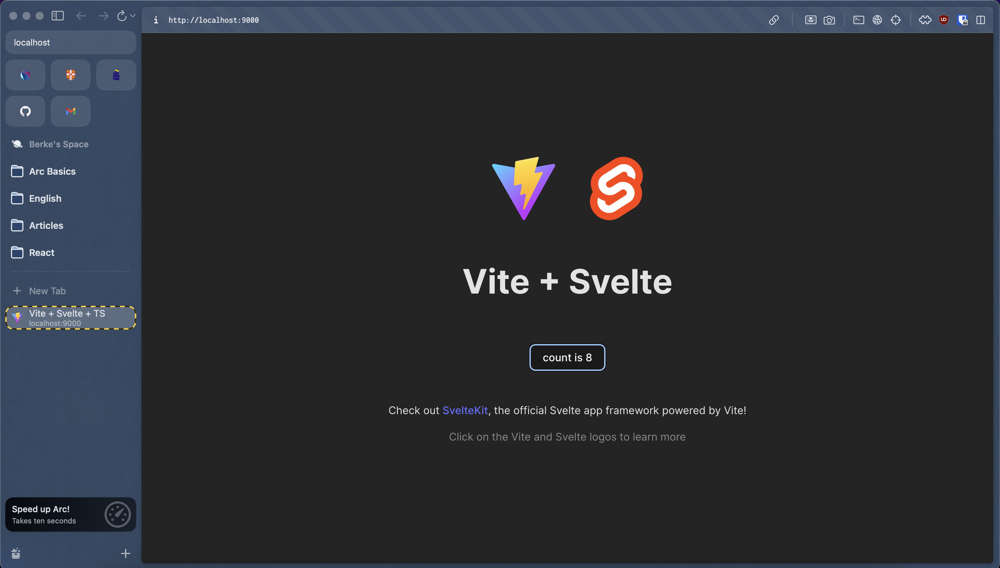

## Svelte Application

The provided Dockerfile sets up a containerized environment for a Svelte application.

#### Dockerfile

```dockerfile
FROM node:21-slim
WORKDIR /react-app
COPY package.json .
RUN npm install
COPY src/ .
COPY . .
RUN npm install -g live-server
RUN npm run build
EXPOSE 8080
CMD ["live-server", "dist"]
```

#### Build Image

```bash
docker build . -t svelte-app
```

#### Check Images

```bash
docker images
```

```bash
REPOSITORY     TAG           IMAGE ID       CREATED          SIZE
svelte-app     latest        10a3523fdd95   15 seconds ago   414MB
```

#### Run Container

```bash
docker run --name svelte-app-c -p 9000:8080 svelte-app
```

- Go to `localhost:9000`

#### Check Containers

```bash
docker ps
docker container ls
```

```bash
CONTAINER ID   IMAGE        COMMAND                  CREATED         STATUS         PORTS                    NAMES
341d3f6af4c2   svelte-app   "docker-entrypoint.s…"   5 seconds ago   Up 4 seconds   0.0.0.0:9000->8080/tcp   svelte-app-c
```


